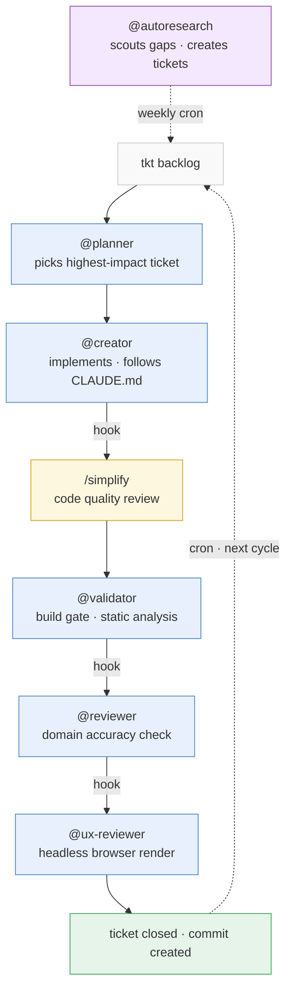

# MiraStack

You write a ticket. You go to sleep. You wake up and the work is done — implemented, validated, reviewed, and committed.

That's not a pitch. That's what MiraStack does every night for [AP IB Study Guides](https://apibstudyguide.com), where 30+ study guides across 13 subjects are created and maintained by this pipeline. No babysitting. No "can you fix the formatting" follow-ups. The agents read your CLAUDE.md, follow your conventions, and enforce quality through a hook-chained pipeline that won't let a ticket close until every check passes.

**Battle-tested.** This pipeline has been running autonomously since early March 2026, processing hundreds of tickets across content creation, SEO optimization, bug fixes, and competitive analysis. Every failure mode documented in [docs/failure-modes.md](docs/failure-modes.md) was discovered in production and has a corresponding mitigation built in.

**Next deployment:** [favcollege](https://favcollege.com) — a college comparison platform. Completely different domain, same pipeline. That's the point.

## The Problem

Claude Code is powerful. But a single agent session is a conversation — it does what you tell it, then stops. If you want continuous, autonomous output, you end up stitching together cron jobs, writing wrapper scripts, and manually chaining "ok now review that" after every change.

MiraStack is the stitching, done once, so you don't have to.

## What You Get

Six specialized agents and a hook pipeline that chains them automatically:



The planner spawns the creator. Hooks handle the rest. The dotted line back to the backlog is cron — the loop runs autonomously on a schedule. You don't orchestrate — you review the output.

| Agent | Role |
|---|---|
| **@planner** | TPM — picks highest-impact ticket, orchestrates the pipeline, verifies acceptance criteria |
| **@creator** | Implements changes following your CLAUDE.md conventions, checks companion materials |
| **@validator** | Static analysis, build gate, acceptance criteria, placeholder detection, language checks |
| **@reviewer** | Domain accuracy review (reads CLAUDE.md for context), writes structured reports |
| **@ux-reviewer** | Headless browser rendering checks via Puppeteer, acceptance criteria verification |
| **@autoresearch** | Discovers growth opportunities, creates tickets |

Plus:
- **Ticket closure gate** — a hook that blocks `tkt close` unless the latest UX review is clean. Tag-based bypass for non-content tickets (tooling, SEO, analytics).
- **Feedback sync** — GitHub Issues become tkt tickets automatically on every session start.
- **Structured AC verification** — every acceptance criterion is individually verified and recorded in a `[pass]`/`[fail]` format before ticket closure.
- **Analytics integration** (optional) — GA4 + Search Console data so agents prioritize by real traffic, not guesses.
- **Daily digest** (optional) — email summary of what happened overnight, via Resend.

## Why This Shape

Most agent frameworks give you building blocks and say "compose them." MiraStack is opinionated:

**Agents read CLAUDE.md, not hardcoded knowledge.** The same six agents work for a study guide site, a SaaS API, a college comparison platform, or a blog. Your CLAUDE.md is the domain knowledge. Swap projects, keep the pipeline.

**Ticket-driven, always.** Every piece of work flows through a tkt ticket. The planner picks from the backlog. The creator references the ticket. The validator checks acceptance criteria. You get an auditable trail of what was done and why.

**Hook-enforced, not convention-enforced.** The quality chain runs because SubagentStop hooks fire automatically, not because someone remembered to type `@validator` after the creator finished. Remove a human from the loop and the pipeline still works.

**Human-in-the-loop where it counts.** Content commits push automatically. Structural changes commit but never push — you review with `git log origin/main..HEAD` and push when satisfied.

## Quick Start

### Option A: Claude Code Plugin (recommended)

```bash
claude plugin install kulisama81/mirastack
```

All 6 agents, hooks, and scripts load automatically. Then:

1. Copy and configure `templates/workflow-config.json` → `.claude/workflow-config.json`
2. Install [tkt](https://github.com/lawrips/tkt): `go install github.com/lawrips/tkt@latest && tkt init`
3. Add tkt as an MCP server in `.mcp.json`
4. Write your CLAUDE.md (see `templates/CLAUDE.md.example`)
5. Set up cron (see below)

### Option B: Manual Install

<details>
<summary>Step-by-step for manual setup</summary>

#### 1. Copy agents

```bash
cp -r /path/to/mirastack/agents/ .claude/agents/
```

#### 2. Configure workflow

```bash
cp /path/to/mirastack/templates/workflow-config.json .claude/workflow-config.json
```

Edit to match your project — at minimum set `validator.buildCommand`, `validator.contentDir`, and `uxReviewer.devCommand`.

#### 3. Merge hooks

Copy the hooks from `hooks/hooks.json` into your `.claude/settings.json`. If you already have hooks, merge the arrays.

#### 4. Copy scripts

```bash
cp -r /path/to/mirastack/bin/ bin/
```

Scripts read configuration from `workflow-config.json` — no hardcoded values to change.

#### 5. Set up tkt

```bash
go install github.com/lawrips/tkt@latest
tkt init
```

Add to `.mcp.json`:
```json
{
  "mcpServers": {
    "tkt": {
      "command": "tkt",
      "args": ["mcp"]
    }
  }
}
```

#### 6. Write your CLAUDE.md

The agents don't have hardcoded domain knowledge — they read yours. See `templates/CLAUDE.md.example` for what to include: project conventions, domain knowledge, content patterns.

</details>

### Set Up Cron

This is what makes it autonomous. Agents run on a schedule, pick tickets, and ship while you're away.

```bash
cp /path/to/mirastack/templates/crontab.example /tmp/mirastack-cron
# Edit paths, then:
crontab /tmp/mirastack-cron
```

| Job | Schedule | What it does |
|---|---|---|
| `@planner` | Twice daily, 2 AM + 2 PM | Picks tickets, runs the full pipeline, commits |
| `@autoresearch` | Weekly, Monday 3 AM | Discovers content gaps, SEO issues, competitor features |
| `pull-analytics.mjs` | Daily 1 AM | Refreshes traffic data for agent prioritization |
| `daily-digest.mjs` | Daily 8 AM | Emails you a summary of traffic + agent activity |
| `sync-feedback.mjs` | Every 30 min | Pulls GitHub Issues into tkt tickets |

See [docs/cron-setup.md](docs/cron-setup.md) for full details.

## Configuration

All project-specific values live in `workflow-config.json`:

```json
{
  "validator": {
    "buildCommand": "npm run build",
    "contentDir": "src/content",
    "checks": [
      "build", "frontmatter", "heading-hierarchy", "katex",
      "no-placeholder", "empty-sections", "duplicate-content",
      "companion-sync", "connected-categories", "language-conventions"
    ],
    "languageRules": {
      "ap-french": {
        "language": "French",
        "requiredChars": ["e", "a"],
        "commonErrors": { "francais": "fran\u00e7ais" }
      }
    }
  },
  "uxReviewer": {
    "devCommand": "npx astro dev",
    "checks": [
      "console-errors", "broken-images", "layout-overflow",
      "placeholder-text", "grid-stretch", "iframe-issues"
    ]
  },
  "feedbackSync": {
    "repo": "owner/repo",
    "label": "user-submitted"
  },
  "analytics": {
    "propertyId": "YOUR_GA4_PROPERTY_ID",
    "gscSiteUrl": "sc-domain:yourdomain.com"
  },
  "digest": {
    "toEmail": ["you@example.com"],
    "fromEmail": "digest@yourdomain.com",
    "projectName": "My Project"
  }
}
```

## Validation Checks

### Content Validator (`bin/content-validate.mjs`)

| Check | What it does |
|---|---|
| `build` | Runs the build command and fails on error |
| `frontmatter` | Validates required frontmatter fields |
| `heading-hierarchy` | Ensures h2 -> h3 -> h4 order |
| `katex` | Checks for unbalanced braces in math expressions |
| `svg-blank-lines` | Detects blank lines inside SVG blocks in .md files |
| `html-comments` | Flags `<!-- -->` in .mdx files (should be `{/* */}`) |
| `video-embeds` | Validates iframe src attributes |
| `internal-links` | Checks that internal links resolve |
| `no-placeholder` | Flags "coming soon", "TBD", "TODO" in content |
| `empty-sections` | Finds headings with no content before next heading |
| `duplicate-content` | Detects verbatim paragraphs shared across files |
| `content-length` | Advisory warning for files exceeding threshold |
| `companion-sync` | Checks companion materials are up to date |
| `connected-categories` | Verifies content categories are wired to site |
| `language-conventions` | Per-subject spelling and orthographic rules |
| `hardcoded-consistency` | Flags hardcoded counts that drift from reality |

### UX Reviewer (`bin/ux-review.mjs`)

| Check | What it does |
|---|---|
| `console-errors` | Always on — captures JS console errors |
| `broken-images` | Always on — finds images with naturalWidth === 0 |
| `layout-overflow` | Always on — detects horizontal overflow |
| `katex` | Finds `.katex-error` elements |
| `mermaid` | Finds `.mermaid` elements without rendered SVGs |
| `placeholder-text` | Finds placeholder phrases in rendered page text |
| `grid-stretch` | Detects unequal card widths in grid layouts |
| `raw-svg-text` | Finds SVG code rendered as visible text |
| `iframe-issues` | Finds iframes with empty src or zero dimensions |

## Failure Modes

We document the 8 failure modes observed in production and their mitigations. See [docs/failure-modes.md](docs/failure-modes.md).

## Optional Integrations

### GA4 Analytics
Feeds real traffic data to @planner and @autoresearch for data-driven prioritization.

1. Create a GA4 service account and download credentials
2. Save as `.ga-credentials.json` (gitignored)
3. Set `analytics.propertyId` in workflow-config.json
4. Run `node bin/pull-analytics.mjs`

### Google Search Console
Adds search query data (impressions, clicks, CTR, position) to the analytics report.

1. Add the same service account to Search Console
2. Set `analytics.gscSiteUrl` in workflow-config.json

### Daily Digest Email
Sends a daily summary of traffic, content health, pipeline activity, and unpushed commits.

1. Sign up for [Resend](https://resend.com) and verify your domain
2. Set `RESEND_API_KEY` in your `.env`
3. Configure `digest.toEmail`, `digest.fromEmail`, `digest.projectName`
4. Add to cron: `0 8 * * * cd /path/to/project && node bin/daily-digest.mjs`

### GitHub Issues -> tkt Sync
Automatically creates tkt tickets from GitHub Issues with a specific label.

1. Set `GITHUB_TOKEN` in your `.env`
2. Configure `feedbackSync.repo` and `feedbackSync.label`
3. Runs automatically on SessionStart (via hook) or on cron

## Showcase

**[AP IB Study Guides](https://apibstudyguide.com)** — The project where MiraStack was born. 30+ study guides across 13 subjects, created and maintained autonomously by this pipeline.

## License

MIT — kulisama81
